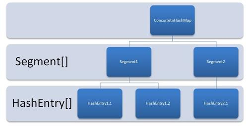

## Java
### 语言基础

#### 静态变量和实例变量的区别

- 修饰不一样：静态变量的修饰需要用`static`关键字，实例变量则不需要
- 初始化机制不一样：静态变量是随着类的加载而加载，实例变量这是需要通过`new`关键字
- 调用方式不一样：静态变量直接通过类名称调用，实例变量需要通过对象调用
- 生命周期不一样：静态变量随着类的生成而生成，随着JVM的消失而消失，实例变量随着对象的产生而产生，随着对应引用的消失而消失

#### 重载

方法A有两个重载方法`void A(List<String>) {}`和`void A(List<Integer>) {}`，是否允许这样的重载方式

- 不允许，JVM在编译时，对于这两个方法来说其实是同一个，因为JVM没有泛型

#### 强引用、软引用、弱引用、虚引用

- 强引用：平时开发的时候最常见，比如`Object obj = new Object();`这样的声明定义就会产生该对象的强引用。只要有强引用的指向，并且`GC Roots可达`，在GC时即使内存濒临耗尽也不会回收该对象
- 软引用：引用的力度比强引用弱，主要作用与非对象上，用来缓存中间计算结果以及不需要实时保存的用户行为等。在JVM即将OOM之前，GC会把这些软引用的对象加入要GC的范围，以获取更多的内存空间
- 弱引用：引用力度比强/软引用都要弱，主要是用来描述非必须的对象，如果一个对象只存在弱引用的指向，则JVM在下一次的YGC时就会被回收，但是YGC的事件不是确定的（只有年轻代空间满了才会进行一次的YGC），所有弱引用的回收时间也是不确定的。所有在调用`WeakReference.get()`方法的时候就有可能会返回`null`，出现空指针的异常
- 虚引用：比如要和引用队列联合使用，如果在GC时发现有虚引用的存在，就会回收对象前，把这个虚引用加入与之关联的引用队列中，通常都是用来管理堆外内存的

#### StringBuilder、与StringBuffer有那些区别

- 两者都继承自 `AbstractStringBuilder`抽象类

- StringBuffer 用了`synchronized`关键字保证了线程安全性，StringBuilder 并没有所以 StringBuilder 线程不安全
- 也因为 StringBuffer 用了`synchronized`关键字带来了性能开销，也间接的导致单线程的情况下性能比 StringBuilder 差一些

#### 对象创建的过程

#### Object 类有哪些方法

#### Object object = new Object() 中占多少字节
  - `markword`占**8**字节
  - 对象引用占**4**字节
  - 对其补齐**4**字节

### 容器

#### Java容器有哪些
#### 那些是同步容器，那些是并发容器

- java.util.

#### ArrayList 和 LinkedList 的原理区别

###### ArrayList

1. 基于动态数组实现，且数组初始长度为`0`
2. 线程不安全
3. 空间浪费主要体现在在`list`列表的结尾预留一定的容量空间
4. 是一个 object 类型的空数组，在第一次`add`了之后会将容量设置为 10，size 还是为 0，当数组首次扩容的 10 个空间用完需要扩容后，会第二次走`grow`方法来扩容（每次扩容为原容量的`1.5`倍）
5. 每一次扩容都是要对数组进行复制，如果反复扩容会对程序的运行效率产生影响，所以在初始化 ArrayList 的时候尽量初始化容量避免其进行扩容影响性能

###### LinkedList

1. 基于链表实现
2. 线程安全
3. 空间花费则体现在它的每一个元素都需要消耗相当的空间

###### 总结

1. 对于随机index访问的`get`和`set`方法，`ArrayList`可以通过数组下标直接找到元素，所以`ArrayList`的速度要***优于***`LinkedList`
2. 由于`ArrayList`有扩容的情况存在，所以`ArrayList`的性能要***差于***`LinkedList`

#### HashMap 和 TreeMap 的区别

#### HashMap 和 ConcurrentHashMap 原理和区别

###### HashMap

1. 内部常量`加载因子`的默认为0.75、默认容量大小为16，最大为2^30，
2. `寻址算法`主要是根据计算key的`hashCode`值，然后右移16位，并与原来的进行异或处理，这样经过高低位的异或运算可以降低哈希碰撞的概率
3. 线程不安全

- JDK 1.7
  - 存储结构由数组+链表的方式
  - 对链表的处理采用的是头插法，在多线程的环境下采用头插法就有可能使链表形成环状（对调用扩容容器大小的方法时），导致出现循环链表，所以也是导致线程不安全的原因
- JDK 1.8
  - 存储结构由数组+链表+红黑树的方式
  - 当链表长度达到8以及数组容量达到64时，链表会进行树化
  - 对头插法进行改进，采用尾插法，避免产生死循环

###### ConcurrentHashMap

1. 为了保证线程安全，就得给让所有访问HashMap的线程都对同一把锁进行竞争（`HashTable`就是通过使用`synchronized`来保证线程安全），导致性能低下，
3. 分段加锁，默认分为16个Segment（小段的HashMap），也称为并发度为16
- JDK 1.7
  - 把数组拆成小数组，进行分段加锁
- JDK 1.8
  - 通过对数组的每个元素执行CAS的策略对数组中的元素进行put操作，锁的粒度针对数组每个元素
- ConcurrentHashMap 仅保证提供的原子性读写操作线程安全，但是不代表对其的多个操作之间的状态一致，还是会有线程安全的问题，可以对整段逻辑加锁



### 多线程/并发

#### 线程状态

- New（新建：使用了`new`关键字创建一个线程后，但尚未启动的线程处于此状态）

- RUNNABLE（就绪：当线程对象调用了`start()`方法之后，该线程此状态，JVM此时为其创建了方法调用栈和程序计数器，等待CPU分配时间片）

- RUNNING（运行：获取到 CPU 分配的时间片执行权，开始执行`run()`方法）

- Blocked（堵塞：因为某种原因放弃了CPU时间片的使用权，被阻塞等待监视器锁定的线程处于此状态）

  - wait（等待堵塞：JVM将其放在等待队列）

  - lock（同步堵住：该线程在获取对象的同步锁时，若该同步锁被别的线程占用，则 JVM 会把该线程放入锁池`lock pool`中）

  - sleep/join（其他堵塞：执行`sleep()`或`join()`方法，或者发出了 I/O 请求时，JVM 会把该线程置为阻塞状态。当 sleep()状态超时、join()等待线程终止或者超时、或者 I/O 处理完毕时，线程重新转入`RUNNABLE`状态）

    `可以通过 sleep(0) 这种方式作为SafePoint，让出CPU时间片的执行权，进行GC`

- DEAD（死亡：已推出的线程处于此状态）

  - 正常结束：run()、call()方法实行完成
  - 异常结束：抛出Exception或Error
  - 调用stop()：调用该线程的方法（通常容易发生死锁）

  

#### 线程安全语义

> 其实应该是内存安全，堆是共享内存，可以被所有线程访问

#### 线程池

##### 特点

- 线程复用

- 控制最大并发数

- 管理线程

##### 线程池参数

- corePoolSize（核心线程数）

  **线程池当中线程数最基本上的数量**：只有当工作任务队列满了才会有新的线程被创建出来，此时线程数才会大于该值

- maximumPoolSize（最大线程数）

  **线程池中允许的最大线程数**：当前任务队列满了并且小于该值的时候线程才会被创建，否则交给拒绝策略

- keepAliveTime（空闲存活时间）

- unit（时间单位）

- workQueue（线程任务工作队列）

  1. **当没有线程任务时**，能够堵塞获取线程任务，使得线程进入wait状态，交出CPU时间片使用权

  2. **当有任务时**，如果线程任务过多超过队列长度在普通的队列下则无法保留，堵塞队列则可以保留住想进入队列的线程任务

- threadFactory（线程工厂）

- RejectedExecutiorHandle（线程池拒绝策略）
  - AboutPolicy（默认）：丢弃任务并抛出 RejectedExecutionException 异常
  - DiscardPolicy：也是丢弃任务，但是不抛出异常
  - DiscardOldestPolicy：丢弃队列最前面的任务，然后重新尝试执行任务（重复此过程）
  - CallerRunsPolicy：由调用线程处理该任务
  - 自定义

##### 线程的启动

在刚刚创建 ThreadPoolExecutor 的时候，线程并不会立即启动，而是要等到有任务提交时才会启动，除非调用了`prestartCoreThread` 或 `prestartAllCoreThreads`事先启动核心线程

##### 底层工作原理

1. 判断**线程池里的核心线程**是否都在执行任务，如果不是（核心线程空闲或者还有核心线程没有被创建）则创建一个新的工作线程来执行任务。如果核心线程都在执行任务，则进入下个流程
2. 线程池判断工作队列是否已满，如果工作队列没有满，则将新提交的任务存储在这个工作队列里。如果工作队列满了，则进入下个流程
3. 判断**线程池里的线程**是否都处于工作状态，并且已达最大线程数，如果没有，则创建一个新的工作线程来执行任务。如果已经满了，则交给饱和策略来处理这个任务

#### 线程之间的通信

线程之间是通过网络或者共享内存通信

#### 线程内存模型

#### ThreadLocal

- 主要用于线程本地化存储，即只有本线程才能对该变量进行查看或者修改
- 使用时需要注意，在不使用该变量的时候，一定要调用`remove`方法删除变量，否则可能会造成内存泄露的问题
- ThreadLocal 是由 ThreadLocalMap 实现

#### RenteenLock 底层原理

#### CAS 是什么？以及无锁化原理

  - 全名为`CompareAndSet`，是多线程情况下,线程安全的执行机制
  - 多线程的情况下，线程的最初状态为无锁态，通过和其他线程进行竞争，通过CAS获取值和赋值之后与目标值进行对比，如果值和原来的一样说明还没有被其他的线程修改过，则将值修改掉，竞争失败的线程会从无锁态变成升级为自转偏向锁

#### AQS是什么

- 是一套多线程访问共享资源的同步器框架，非/公平锁（悲观锁），其本质就是Synchronized关键字。在这个框架下，先通过CAS的方式获取乐观锁，获取不到则就变成悲观锁（例如：ReentrantLock、Semaphore、CountDownLatch）

- 机制

  1. 在AQS中，维护了一个信号量state和一个线程组成的双向链表队列。其中这个线程队列就是用来给线程排队的，而state就像是一个红绿灯，用来控制线程排队或者放行的，在不同的场景下，有不同场景下有不同的意义

  2. 在可重入锁场景下，state就用来表示加锁的次数。0表示无锁，每加一次锁state+1，释放锁 state-1

  

#### volatile

##### 作用

  - 禁止指令重排序
  - 变量可见性

##### happens-before

- 程序次序规则
- 锁定规则
- 变量规则
- 传递规则
- 线程启动规则
- 线程终端规则
- 线程终结规则
- 对象终结规则

##### 底层实现

  - 内存屏障

      JVM回发送一条`lock前缀指令`给CPU，CPU在计算完之后会立即将这个值写回到主内存，同事因为有`MESI缓存一致性协议`，所以各个CPU都会对总线进行嗅探。自己本地缓存中的数据时候被别人修改

#### synchronized

> 可以把任意一个非 NULL 的对象当作锁。他属于独占式的悲观锁，同时属于可重入锁，非公平锁

##### 特性

- 原子性

  被 synchronized 修饰的代码在同一时间只能被一个线程访问，在锁未释放之前，无法被其他线程访问到。因此，在 Java 中可以使用 synchronized 来保证方法和代码块内的操作是原子性的

- 可见性

  对一个变量解锁之前，必须先把此变量同步回主存中。这样解锁后，后续线程就可以访问到被修改后的值。

- 有序性

  synchronized 本身是无法禁止指令重排和处理器优化的

##### 实现原理

 - 在底层编译后的JVM指令中，会有`monitorenter`和`moniorexit`指令
 - 线程在加锁的时候会获取对象monitor的lock，并且monitor计数器+1，如果另外一个线程获取的monitor计数器大于0则表明改对象已经被加锁，线程会陷入堵塞等待锁的状态
 - 内存屏障

##### 与ReentrantLock（可重入锁）的区别

###### 不同点

- ReentrantLock 需要主动的通过调用 lock()与 unlock() 方法来进行加锁与解锁操作，而 synchronized 只是作为一个关键字即可，并且解锁的动作由JVM 自动来完成，不同于ReentrantLock 需要调用unlock() 方法手动解锁

###### 相同点

- 都是可重入锁，与ReentrantLock 的 lock()一样都是非公平锁

#### 锁升级的过程

- 无锁
- 偏向锁
- 自旋锁（轻量级锁）
- 重量级锁

## IO

### BIO
####  通信原理（同步堵塞）


- 服务端会有个ServerSocket，每一个ServerSocket都有一个与之对应ClientSocket，每一个连接都需要有一个线程来维护

### NIO
#### 通信原理（同步非堵塞）


- 一个Selector（多路复用器）线程，客户端与服务端简历连接时会建立一个Channel，所有的Channel都在Selector上注册，Selector对每个Channel进行轮询，如果该Channel发生了读写事件接受到消息时，将Channel取出来，通过SelectionKey获取有读写事件的Channel，新建一个工作线程，读取Channel里面的信息，处理好之后，通过Channel将处理的信息返回给客户端，工作线程和Channel通过buffer读写数据，然后再销毁工作线程

### AIO
#### 通信原理（异步非堵塞）

- 主要处理逻辑和NIO基本上类似，但是会有一个buffer给操作系统，异步让操作系统去读取/写入数据，完成数据的读取/写入之后回调一个方法

### Netty（网络框架） 

#### 线程模型
- 主要处理逻辑

### Reactor三种线程模型

## JVM
#### 内存模型（JMM）

##### 方法区（常量、静态变量）

##### 本地方法栈

##### 栈（线程）

##### 堆（方法、变量）

##### 程序计数器（PC）


#### 年代区域的划分

- 年轻代主要分为`Edan`区、Survivor区（`from/S1`区、`to/S2`区），这三者的区域大小划分比例为`8:1:1`
- 年轻代中对象被GC清理在S1与S2轮转`15`次之后会被移到老年代（这个值可以通过JVM参数：–XX:SurvivorRatio 设定，默认值为8）
- 年轻代与老年代区域大小划分比例为`1:2`（该值可以通过JVM参数：-XX:NewRatio 设定）


#### 垃圾可回收的判断依据

- `GC Roots`根节点：类加载器、Thread、`虚拟机栈的本地变量表`、static成员、常量引用、本地方法栈的变量等

  > 可达性分析法（GC Roots），基本思想就是通过“GC Roots”的对象作为起点，从这些节点开始向下搜索，节点所走过的路径称为引用链，当一个对象到GC Roots没有任何引用链相连的话，则证明此对象是不可用的

#### 垃圾回收算法

##### 复制算法

##### 标记清理算法

##### 标记整理算法

##### 分代收集算法

- 年轻代（Minor GC）：复制算法

- 老年代（Full GC）：标记清理算法（CMS），标记整理算法（Serial、ParNew、G1）


#### 为什么使用这个算法?

#### 各个垃圾收集器的区别

##### Serial 垃圾收集器

>  是一个单线程的垃圾收集器，其垃圾清理算法在新生代采用`复制`算法，老年代采用`标记-整理`算法

- 缺点：由于是单线程所以在执行垃圾清理的时候会有长时间的独占CPU（`STW`）
- 优点：简单又高效

##### ParNew 垃圾收集器

>  是一个针对Serial进行多线程升级的垃圾收集器，其垃圾清理算法在新生代采用`复制`算法，老年代采用`标记-整理`算法

##### Parallel Scavenge 垃圾收集器

> 类似于 ParNew 垃圾收集器，但是针对的场景有所不同，关注点主要是吞吐量（即：CPU中用于运行用户代码的时间与CPU总消耗时间的比值），更高效的利用CPU资源，其垃圾清理算法在新生代采用`复制`算法，老年代采用`标记-整理`算法

##### Serial Old 垃圾收集器

>  是 Serial 老年代版本，也是单线程处理垃圾收集，主要用在JDK1.5 以前的版本，以及配合`Parallel Scavenge`垃圾收集器搭配使用

##### Parallel Old 垃圾收集器

>  `Parallel Scavenge`收集器的老年代版本

##### CMS 垃圾收集器

- 执行步骤
  1. 初始标记：独占CPU（`STW`），仅标记`GCRoots`能直接关联地对象
  2. 并发标记：可以和用户线程并发执行，通过`GCRoots Tracing`标记所有可达对象
  3. 重新标记：独占CPU（`STW`），对并发标记阶段用户线程运行产生的垃圾对象进行标记修正
  4. 删除标记：可以和用户线程并行执行，清理垃圾
- 优点：
  - 有多条垃圾收集线程并行执行，低停顿
  - 用户线程与垃圾收集线程同时执行
- 缺点：
  - 不停地停顿线程，比较消耗内存，整体效率低
  - 在和用户线程并发的去执行清理过程中，用户线程其实也会产生垃圾，这部分的浮动垃圾只有等到下次GC的时候才会被清除掉
  - 标记清除过程中会产生比较多的的垃圾碎片，导致年轻代的垃圾晋升到老年代。即使空间有很大，但是无法找到一块连续空间来分配对象，容易发生FullGC

##### G1 垃圾收集器（JDK1.7 引入）

- 
- 执行步骤
  1. 初始标识：
  2. 并发标记：
  3. 最终标记：
  4. 筛选回收：
- 优点
  - 空间整合：引入了一个`独立区`（Region）的概念，从整体的角度看利用的是`标记整理法`，从局部或者从一个`独立区`（Region）来看的话利用的是`标记复制法`，这两种回收算法其实在执行GC期间不会产生内存碎片
  - 分代收集：可以自己管理新生代和老年代
  - 可预测的停顿：
- 缺点
  - 针对机器内存较大的场景下比较适合

##### 选择合适的垃圾收集器（官方推荐G1，性能高）

1. 优先调整堆的大小让服务器自己来选择
2. 如果内存小于100MB，使用串行收集器
3. 如果是单核，并且没有停顿时间的要求，串行或JVM自己选择
4. 如果允许停顿时间超过1秒，选择并行或者JVM自己选
5. 如果响应时间最重要，并且不能超过1秒，使用并发收集器

#### GC调优

##### 调优步骤

1. 打印GC日志
    ``` bash
   -XX:+PrintGCDetails -XX:+PrintGCTimeStamps -XX:+PrintGCDateStamps -Xloggc:./gc.log
   ````

2. 分析日志得到关键性指标
3. 分析GC原因，调优JVM参数

##### GC常用参数

- 堆栈设置
  -Xss: 每个线程的栈大小
  -Xms: 初始堆大小，默认物理内存的1/64
  -Xmx: 最大堆大小，默认物理内存的1/4
  -Xmn: 新生代大小
  -XX:NewSize: 设置新生代初始大小
  -XX:NewRatio: 默认2表示新生代占年老代的1/2，占整个堆内存的1/3
  -XX:SurvivorRatio: 默认8表示一个survivor区占用1/8的Eden内存，即1/10的新生代内存
  -XX:MetaspaceSize: 设置元空间大小
  -XX:MaxMetaspaceSize: 设置元空间最大允许大小，默认不受限制，JVM Metaspace 会进行动态扩展
- 垃圾回收统计信息
  -XX: +PrintGC
  -XX: +PrintGCDetails
  -XX: +PrintGCTimeStamps
  -Xloggc: 【FileName】

#### 对象在内存中的存储布局

#### 类的生命周期

1. 加载：将.class文件从磁盘读到内存
2. 连接
- 验证：

  > 验证字节码文件的正确性

- 准备：

  >  给类的静态变量分配内存，并赋予默认值

- 解析：

  >  类装载器装入类所引用的其它所有类

3. 初始化
   为类的静态变量赋予正确的初始值，上述的准备阶段为静态变量赋予的是虚拟机默认的初始值，此处赋予的才是程序
   编写者为变量分配的真正的初始值，执行静态代码块

4. 使用

5. 卸载


#### 类加载器

##### 种类

- 启动类加载器`Bootstrap ClassLoad`

  > 负责加载JRE的核心类库，如JRE目标下的rt.jar，charsets.jar等

- 扩展类加载器`Extension ClassLoad`

  > 负责加载JRE扩展目录ext中jar类包

- 应用程序类加载器`Application ClassLoad`

  > 负责加载Classpath路径下的类包

- 用户程序加载器`User ClassLoad`

  > 负责加载用户自定义路径下的类包


##### 类加载过程

- 通过`双亲委派`的方式加载，类加载请求不会自己直接尝试去加载
- 而是把这个请求委派给父类去完成，最终都是交给所有启动类去完成
- 启动类在相关的目录当中找不到Class的时候才会让子类的加载器去加载

##### 双亲委派模型

>  指先委托父类加载器寻找目标类，在找不到的情况下载自己的路径中查找并载入目标类

#### 类什么时候才被初始化

1. 创建类的实例，也就是 new 一个对象
2. 访问某个接口或类的静态变量，或者对这个静态变量赋值
3. 调用类的静态方法
4. 反射`Class.forName("com.cal.demo")`
5. 初始化一个类的子类（会首先初始化父类）
6. JVM 启动时标明的启动类，即文件名和类名相同的那个类

#### 类的初始化步骤

1. 如果这个类还没有被加载和链接，那么先进行加载和链接
2. 假如这个类存在直接父类，并且这个类还没有被初始化（注意，一个类加载器中只能初始化一次），那就初始化直接的父类
3. 假如类中存在初始化语句（如 static 变量和 static 块），那就依次执行这些初始化语句

## 中间件

### Netty

### ElasricSearch

###### ES的分布式架构原理是什么?
###### 是如何实现分布式的

### Redis
#### Redis和Memcached有什么区别
  - Redis是NIO单线程工作模型,Memcached是多线程的工作模型
    - Redis支持的类似比Memcached多,使用起来更容易
#### Redis有几种部署模式

- 单点
- 哨兵
- 主从复制

#### 在哨兵模式下需要注意的点

- 由于哨兵模式是采取主从复制模式，所以在Slave节点往Master节点复制数据的时候出现宕机的情况，则这些数据会消失
- 在该模式下只有Master节点才有写入，其他节点无法写入数据

#### 在集群模式下，Redis的Key是如何寻址

####  寻址都有那些算法

####  hash一致性算法

#### Redis有几种数据结构

- 字符串(string)
- 哈希(hash)
- 列表(list)
- 集合(set)
- 有序集合(zset)

###### Redis过期策略

- 定期删除: 默认每隔100ms就随机抽取一些设置了过期时间的Key
- 惰性删除: 当查询Key的时候,检查一下是否过期,如果过期就删除
- 结合定期删除+惰性删除一起使用

###### 内存淘汰机制

- allkeys-Random
- allkeys-LRU
- volatile-LRU
- volatile-Random
- volatile-TTL

###### 如何保证Redis高并发和高可用

- 高并发:主从架构(一主多从,弹珠用来写入数据,多从用来查询数据)
- 高可用:主从架构+哨兵模式

Redis持久化有哪几种方式?不同的机制有那些优缺点?持久化机制具体底层是如何实现

###### 什么是缓存雪崩

  - 当Redis集群中某一个Salve在一段时间内失效后,发生大量的缓存穿透,造成了缓存的雪崩
###### 有什么办法可以防止缓存雪崩
  - 可以通过随机算法让失效时间随机分布,避免同一时刻失效
  - 事前:保证Redis集群高可用
  - 事中:使用`Hystrix`组件对请求进行限流、降级
  - 事后:Redis必须要做持久化
###### 什么是缓存穿透
  - 访问一个不存在的Key时,此时缓存不起作用,直接请求DB,此时请求量巨大且在DB中也没有查到,可能会直接导致DB挂掉
###### 如何解决缓存穿透
  - 访问Key没有在DB中查询到值得话,也将NULL值写入缓存,但是可以设置一个较短得过期时间
  - 使用布隆过滤器,使用一个足够大的bitmap,用户存储可能访问的Key,不存在的Key直接被布隆过滤器过滤掉
###### 线程模型

  - 为什么单线效率还这么高
    - 非堵塞的IO多路复用模型

###### 多路复用底层实现

###### 高并发下如何解决数据库和缓存双写不一致的问题

- 更新数据的时候先删除缓存,在修改数据库中的值
- 使用内存队列对并发请求压到队列中,逐个处理
- 对更新操作进行去重

### RabbitMQ

#### 优缺点

- 优点：

  1. 解除业务系统之间的耦合，降低系统之间的依赖关系

  2. 实现消息的异步处理，无需同步等待

  3. 削峰填谷，将流量从高峰期引到低谷期进行处理

- 缺点：

  1. 增加了系统的复杂度，带入了幂等、重复消费、消息丢失的问题
  2. 系统的可用性比原先要低，还需要额外保证MQ的可用性
  3. 消费端数据一致性问题

#### 使用场景

- 消息订阅
- 日志采集
- 埋点

#### 如何保证MQ中的消息不被丢失

消息丢失的情况主要在以下这几个环节：生产者发生异常没有把消息成功发送给MQ、MQ成功接收到消息之后发生宕机了，消息未被成功消费、消费者成功消费消息但是发生宕机了

###### 当MQ的消费者宕机时,怎么保证MQ中的消息不被丢失

  - 场景1:生产者消息投递到MQ后，消费者拿到消息后，默认是自动确认签收机制，消息队列将删除这条消息，但是如果仅仅是拿到但是没有来得及处理业务逻辑时，消费者就宕机，那么此消息将会丢失，以后也不会再收到。
  - 办法:消费端要设置签收机制为手动签收，只有当消息最终被处理，才告诉MQ已经消费，此时MQ再去删除这条消息。
###### 当MQ集群宕机时,怎么保证MQ中的消息不被丢失

#### 如何解决消息被重复消费

消费端实现幂等操作，一个数据或一个请求，重复来多次，确保对应的数据是不会改变的，不能出错

- 生产者发送消息的时候带上一个全局唯一的id，消费者拿到消息后，先根据这个id去 Redis 里查一下，之前有没消费过，没有消费过就处理，并且写入这个id到 Redis，如果消费过了，则不处理。
- 基于数据库的唯一键

### Zookeeper

#### 节点选举机制

一致性算法

分布式锁

## Spring

#### 框架涉及到的设计模式

- 根据配置文件自动装配的策略模式
- Bean 初始化使用的工厂模式
- Bean实例的单例模式
- 针对处理Request请求的装饰者模式、责任链模式
- ApplicationEvent 内置事件和 Listener 监听器的观察者模式
- 适配器模式

#### AOP 原理及应用

#### IOC 原理及应用

#### 动态代理

- cglib动态代理
- JDK动态代理

#### Spring 容器的启动流程

- 创建Spring容器（`ApplicationContext`）
  - 首先会进行扫描（通过`BeanFactoryPostProcessor`来实现，依赖注入通过`BeanPostProcessor`来实现），扫描得到的所有的`BeanDefinition`对象，并存在一个 Map 中
  - 通过筛选出非懒加载的单例`BeanDefinition`进行创建Bean对象，对于多例Bean不需要在启动过程中进行创建，对于多例Bean会在每次获取Bean时利用`BeanDefinition`去创建
- 一些`BeanFactoryPostProcessor`和`BeanPostProcessor`，的注册  单例 Bean 创建完成后，Spring 会发布一个容器启动事件（`ContextRefreshedEvent`继承自`ApplicationEvent`）
- Spring 启动结束

#### Spring Bean 的生命周期

- Bean的定义——>Bean的初始化——>Bean的使用——>Bean的销毁

#### Spring中Bean是不是线程安全

- 线程不安全

- Spring容器中Bean可以分为5个范围
  - `singleton`：默认，每个容器只有一个Bean实例
  - `rototype`：为每一个Bean请求提供一个实例
  - `request`：为每一个网络请求创建一个实例，在请求完成以后，Bean回失效并被垃圾回收器回收
  - `session`：与request范围类型，确保每个session中有一个bean的实例，在session过期后，bean会随之失效
  - `globel-session`：一般用于Portlet应用环境，该运用域仅适用于WebApplicationContext环境

#### Spring中Controller是不是线程安全

- 线程不安全，会导致属性的重复使用
- 可以通过一下几点进行避免
  1. 不要在Controller中定义成员变量
  2. 如果需要定义成员变量可以使用`ThreadLocal`变量
  3. 如果需要定义非静态的成员变量的时候，可以通过注解`@Scope("prototype")`，设置为多例模式

#### Spring 事务（`@Transactionl`）的执行机制

- 其注解本身用到了 Spring 的 AOP 机制，所以使用了 @Transactionl 注解的 Bean ，Spring 会创建一个代理对象作为 Bean，所以只有代理Bean对象调用方法的时候，这个注解才会生成

- 当调用代理对象的方法时，会先判断该方法上是否加了@Transactionl 注解
- 如果加了，那么就利用事务管理器创建一个数据库连接，并且修改数据库连接的 autocommit 属性为 false ，禁止此连接的自动提交
- 然后执行当前方法，在方法中执行SQL语句
- 执行完当前方法后，如果没有出现异常则提交事务，如果出现了异常，并且这个异常是`需要回滚的那么就回滚事务，否则的话仍然要提交事务`

#### Spring 事务（`@Transactionl`）的失效的情况

- 非`public`修饰的方法
- 事务方法内自身调用另一个事务方法，如果当前事务已提交，另外一个事务方法，着新事务就不受当前事务控制
- 事务方法内部对异常进行了捕获，Spring 感知不到异常则就会失效
- 事务内用了多线程的，并且这些多线程不是用的 Spring 的 `TaskExecutor` 来管理（Spring 事务管理的机制是基于线程的，如果线程发生了变化，则可能会导致失效）
- 事务的方法并不是`Spring的管理类`来调用（相当于不是通过代理类进行调用）
- 数据库自身就不支持事务

#### 事务传播机制

- 在A方法中的事务调用到B方法中的事务，被调用方法的事务向它的调用者进行事务的传播
  - `propagation_required`：如果当前没有事务，就创建一个新事务，如果当前存在事务，就加入该事务（最常用的设置）
  - `propagation_requires_new`：创建新事务，无论当前存不存在事务，都创建新事务
  - `propagation_supports`：支持当前事务，如果当前存在事务，就加入该事务，如果当前不存在事务，就以非事务执行
  - `propagation_not_supports`：以非事务方法执行操作，如果当前存在事务，就把当前事务挂起
  - `propagation_mandatory`：支持当前事务，如果当前存在事务，就加入该事务，如果当前不存在事务，就抛出异常
  - `propagation_never`：以非事务方式执行，如果当前存在

## 微服务

### 服务网关

### 服务注册中心

### Dubbo

### Spring Cloud

### 分布式ID生成

#### 雪花算法

- `Snowflake`生成的是Long类型的ID，一个Long类型占8个字节，每个字节占8比特，也就是说一个Long类型占64个比特。
  Snowflake ID组成结构：`正数位`（占1比特）+ `时间戳`（占41比特）+ `机器ID`（占5比特）+ `数据中心`（占5比特）+ `自增值`（占12比特），总共64比特组成的一个Long类型

#### 数据库自增

#### 号段

### 分布式事务

#### 两阶段协议

主要保证了分布式事务的原子性：即所有结点要么全做要么全不做，所谓的两个阶段是指：第一阶段：准备阶段；第二阶段：提交阶段


#### 三阶段协议

#### 补偿事务（TCC）

要求特点：

- 幂等性
- 二阶段设计
- 锁定事务不隔离
- 允许“空取消”
- 防悬挂

## Mybatis

## MySQL 数据库

### InnoDB实现事务的机制

通过Buffer Pool，LogBuffer，Redo Log，Undo Log来实现事务

### 索引数据结构

### 联合索引底层的数据结构

### InnoDB 和 MyISAM 存储引擎的区别

#### MyISAM

  - 不支持事务
  - 表级锁
  - 属于非聚簇索引
  - 索性信息和表数据信息分三个文件进行存放
#### InnoDB
  - 行级锁
  - 页级锁
  - 属于聚簇索性
  - 索引信息和表数据放在一起，索引的叶子节点上存储行数据信息
  - 在聚簇索引上创建的索引为辅助索引（复合索引、前缀索引、唯一索引都是辅助索引，辅助索引：索引的叶子节点储存的是主键值）
  - 组件最好不要使用`uuid`，太离散的值不适合排序，一条新纪录插入索引树时，可能会导致索引树进行调整的幅度变大，消耗更多的时间和资源

### 底层B+树/B树原理

对于二叉树而言，每个节点只能有两个子节点，如果是一颗单边二叉树，查询某个节点的次数与节点所处的高度相同，时间复杂度为O(n)；如果是一颗平衡二叉树，查找效率高出一半，时间复杂度为O(Log2n)

### SQL优化

#### 找出慢查询的SQL，看一下SQL的执行计划

- 看是否走了索性还是全表扫描
- 执行计划中using temporary常见于group by时会出现，这种情况是最不能忍受的。因为创建临时表会需要消耗很大的时间，也是导致sql变慢的主要原因

- 索性匹配原则
  - 最左前缀匹配原则
  - 范围列匹配

### 事务的隔离级别

#### 读未提交

- | 时间点 |              事务A              |           事务B            |
  | :----- | :-----------------------------: | :------------------------: |
  | T1     |                                 |          开始事务          |
  | T2     |            开始事务             |                            |
  | T3     |                                 |    查询账户余额为1000元    |
  | T4     |                                 |  取出500元把余额改为500元  |
  | T5     | 查询账户余额为500元（发生脏读） |                            |
  | T6     |                                 | 撤销事务，余额恢复为1000元 |
  | T7     |     存入100把余额改为600元      |                            |
  | T8     |            提交事务             |                            |

  - 事务在执行的时候能看到其他事务执行但并没有提交的新插入记录，还能看到其他事务执行但没有提交的对已有记录的更新操作
  - 无法解决隔离和并发的问题

#### 读已提交

- | 时间点 |                           事务A                           |          事务B           |
  | :----- | :-------------------------------------------------------: | :----------------------: |
  | T1     |                                                           |         开始事务         |
  | T2     |                         开始事务                          |                          |
  | T3     |                                                           |   查询账户余额为1000元   |
  | T4     |                   查询账户余额为1000元                    |                          |
  | T5     |                                                           | 取出100元把余额改为900元 |
  | T6     |                                                           |         提交事务         |
  | T7     | 查询账户余额为900元（与T4时间点读取的不一致，不可重复度） |                          |
  
- 事务在执行过程中可以看到其他事务已经提交的新插入的记录、也可以看到其他事务对已有记录的提交更新。导致读取到的是已经提交更新的数据，一个事务范围里面有两个相同的查询却返回了不同的数据

- 可以避免脏读情况的发生

#### 可重复读（MySQL默认隔离级别）

- 确保事务可以多次从一个字段中读取相同的值，可以看到其他事务已经提交的新插入记录。在此事务持续期间，禁止其他事务对此字段的更新，避免脏读和不可重复读，当时会出现幻读的问题

#### 串行化（解决幻读）

- 要求所有的事务都要被串行执行，不能并发执行。如果第一个事务已经在访问数据，第二个事务只能停下来等待，必须等到第一个事务结束否才能恢复运行。可以避免像脏读、不可重复读、幻读的情况发生
- `幻读`发生的情况与`读已提交（不可重复读）`类似，幻读主要是在查询的时候查到了另外一个事务已提交的新插入的数据，而读已提交是查询时查到另外一个事务提交的更新数据

#### 事务隔离级别实现机制

- MVCC机制多版本控制（创建事务ID <= 当前事务ID < 删除事务ID）

- | 事务隔离级别 | 脏读 | 不可重复去 | 幻读 |
  | :----------- | :--: | :--------: | :--: |
  | 读未提交     |  是  |     是     |  是  |
  | 读已提交     |  否  |     是     |  是  |
  | 可重复读     |  否  |     否     |  是  |
  | 串行化       |  否  |     否     |  否  |

  

### 数据库锁

- 在Myisam数据库引擎中一般会给表加锁，执行查询时，会默认加个表共享锁，也就是表读锁，这个时候只能来查，不能写数据；在执行写的时候，会加个表独占锁，也就是表写锁，不能读也不能写
- InnoDB的行锁有共享锁（`lock in share mode`）、排他锁（`for update`）两种，共享锁就是多个事务都可以加共享锁读同一行数据，但是别的事务不能写这行数据；排他锁就是一个事务可以写这行数据，但是别的事务只能读不能写
- InnoDB的表锁有意向共享锁、意向排他锁
- insert、delete、update操作的时候InnoDB会自动给数据行加行级别排他锁

### 乐观锁和悲观锁

## 设计模式
### 什么是DLC单例
### DCL单例到底需不需要加volatile
  - 要加

## 数据结构与算法

- 反转单向链表

## 操作系统
#### 进程间如何通信

- fork（父进程派生出一个fork子进程，共享同一块数据区域）
- pipe（管道）
- 共享内存
- 消息队列

#### 线程间如何切换

- 操作系统使用时间片算法，让CPU给每个线程一个时间片来执行，时间片结束之后，就保存这个线程的状态，然后切换到下一个线程去执行（多线程并发执行的原理），多个线程来回切换，每个线程就在一个时间片里执行。

#### 页面置换算法(FIFO LRU)

#### 银行家算法

## 网络协议


### 应用层

#### 为应用程序提供服务
- 最靠近用户的一层，是为计算机用户提供应用接口，也为用户直接提供各种网络服务。我们常见应用层的网络服务协议有：HTTP，HTTPS，FTP，POP3、SMTP等

### 表示层

#### 数据格式转化，数据加密
- 表示层提供各种用于应用层数据的编码和转换功能,确保一个系统的应用层发送的数据能被另一个系统的应用层识别。如果必要，该层可提供一种标准表示形式，用于将计算机内部的多种数据格式转换成通信中采用的标准表示形式。数据压缩和加密也是表示层可提供的转换功能之一

### 会话层

#### 建立、管理和维护会话
- 会话层就是负责建立、管理和终止表示层实体之间的通信会话。该层的通信由不同设备中的应用程序之间的服务请求和响应组成

### 传输层

#### 建立、管理、维护端到到的连接（`TCP`、`UDP`所在的层）
- 传输层建立了主机端到端的链接，传输层的作用是为上层协议提供端到端的可靠和透明的数据传输服务，包括处理差错控制和流量控制等问题。该层向高层屏蔽了下层数据通信的细节，使高层用户看到的只是在两个传输实体间的一条主机到主机的、可由用户控制和设定的、可靠的数据通路。我们通常说的，`TCP`、`UDP`就是在这一层。端口号既是这里的“端”

### 网络层

#### IP选址及路由选择（`IP`协议层）
- 本层通过IP寻址来建立两个节点之间的连接，为源端的运输层送来的分组，选择合适的路由和交换节点，正确无误地按照地址传送给目的端的运输层。就是通常说的IP层。这一层就是我们经常说的IP协议层。IP协议是Internet的基础

### 数据链路层

#### 提供戒指访问和链路管理
- 将比特组合成字节,再将字节组合成帧,使用链路层地址 (以太网使用MAC地址)来访问介质,并进行差错检测。数据链路层又分为2个子层：逻辑链路控制子层（LLC）和媒体访问控制子层（MAC）
  - 逻辑链路控制子层（LLC）
    - 定义了一些字段使上次协议能共享数据链路层
  - 媒体访问控制子层（MAC）
    - 处理`CSMA`/`CSCD`算法、数据出错校验、成帧等

### 物理层

#### 物理设备
- 实际最终信号的传输是通过物理层实现的。通过物理介质传输比特流。规定了电平、速度和电缆针脚。常用设备有（各种物理设备）集线器、中继器、调制解调器、网线、双绞线、同轴电缆。这些都是物理层的传输介质

## 场景设计

### 本地缓存设计

- 存储载体

  使用`ConcurrentHashMap`作为缓存存储的载体，在一定程度上保证了线程安全，当并非绝对安全，使用时存缓存内容的时候可以用可重入锁lock()下，做个DC

- 淘汰策略

  控制 Map 的容量大小，使用缓存淘汰策略（LRU算法、LFU算法、FIFO、随机）

- 过期删除策略

  提供缓存过期删除策略（定期删除、惰性删除）

- 多级缓存

  类似寄存器那样额外增加L1、L2、L3 多级缓存

- 持久化

  通过序列化的方式将缓存数据持久化到本地，需要复原的时候通过读取本地的持久化文件进行数据加载复原

### 负载均衡设计

#### 基于DNS负载均衡

根据用户不同的IP根据就近原则分流到不同地区的服务器集群（两地三中心），从而减轻某一个机房集群的压力

缺点：如果集群服务的IP地址变更了，由于DNS缓存的原因导致IP地址更新不及时，从而影响负载均衡

#### 基于硬件负载均衡

F5 硬件

#### 基于软件负载均衡

网络协议的7层协议中针对不同协议层来做实现

基于4层（传输层）的负载均衡：LVS

基于7层（应用层）的负债均衡：Nginx、OpenResty （Nginx + C 模块 + Lua 脚本）

负载均衡方案策略：

- 轮询策略
- 权重轮询策略
- 随机策略
- 权重随机策略
- 负载度策略
- 响应速度策略
- Hash策略

## 面经问题

- Zookeeper 上的节点过多 导致服务不可用，这时候要怎么排查，并且解决这个问题

- 由于在 Dubbo 技术栈中使用 Zookeeper 作为注册中心，此时如果将 Zookeeper 也作为分布式锁的载体，那么给 Zookeeper 的压力增大，如何判断这些附加的业务对 Zookeeper 的影响程度？

  1. 通过对 Zookeeper 单独做挡板的方式，得到只作为注册中心时，以及额外作为分布式锁载体时之间对资源的消耗情况，可以粗略预估出一些影响的比例

  2. 不使用 Zookeeper 作为分布式锁，改用 Redis 的方式使用分布式锁，但是需要保证 Redis 的可靠性，Zookeeper 作为注册中心在系统中起着非常重要的角色，避免过多的影响 Zookeeper 的稳定性，分布式锁出现问题可能是影响局部微服务逻辑，但是 Zookeeper 异常则会导致整个系统出现异常
  3. 对系统当中使用分布式锁的地方进行登记，从架构层面对开发规范这个角度对滥用分布式锁的情况进行一定的约束，包括线程池的使用最好也登记一下

- CMS，G1 垃圾回收器中的三色标记说一说

  黑色：该对象已经被标记过了，且该对象下的属性也全部都被标记过了。（程序所需要的对象）
  灰色：对象已经被垃圾收集器扫描过了，但是对象中还存在没有扫描的引用（GC 需要从此对象中去寻找垃圾）
  白色：表示对象没有被垃圾收集器访问过，即表示不可达

- 如何设计一个本地缓存

  见【场景设计——本地缓存设计】

- 如何设计一个负载均衡的解决方案

  见【场景设计——负载均衡设计】

- 说一说对象被创建出来的流程

- 为什么 JDK8 中 HashMap 用红黑树

  主要目的是为了解决当链表元素多了之后，达到一定的阈值时（默认为8），查询操作的效率就会变得很低，这个时候把链表转换为树时间复杂度从原来的`O(n)`变成`O(nlogn)`，大幅提升查询效率

- 为什么 Redis 中 ZSet 用跳表不用红黑树

  跳表跟红黑树相比而言，时间复杂度都是`O(nlogn)`，但是在实现上相对来说比较容易，添加、删除操作也比较高效，但红黑树添加或者删除节点的时候非有重新平衡的性能开销，而且在Redis 原作者在社区解答大家疑问的时候有说过用跳表只是觉得`实现方式比较简单`、`维护简单`，而且`查询范围方便`

- 为什么MySQL 中用 B+ 树而不是用其他的 B 树、AVL 树

- 为什么 epoll 用红黑树不用跳表

- SQL 查询的时候用主键查询快还是用索引查询快

- 执行SQL的时候如何主动使用行级锁

  MySQL 在隐式情况下，使用 Insert、Update、Delete 都是行级锁，如果要显式使用则可以使用`for update` 或`lock in share mode`

- Spring 中在什么情况下会导致注解失效

  Spring 中的 AOP 注解本质上是 Spring 针对这个注解的类会生成一个代理 Bean 对象，在这个代理 Bean 对象中织入了AOP切面的代码逻辑，当只有调用了这个代理 Bean 对象的方法时，才会执行 AOP 注解相关的逻辑，如果不是使用代理 Bean对象访问方法则不会有 AOP 的注解逻辑

- 如何设计一个 RPC 框架

  - 注册中心
  - 网关
    - 熔断
    - 限流
    - 鉴权
  - 配置中心
  - 微服务`RPC`框架
    - 接口服务层
    - 代理层
    - 注册层
    - 路由层
    - 监控层
    - 协议层
    - 交换层
    - 传速层
    - 序列化层
  
- Zookeeper 中是如何保证数据的一致性的

  Zab 数据一致性协议
  
- Zookeeper 出现脑裂情况的时候如何解决

- 平时都会用到哪些序列化引擎

  JDK 自带的 Serializable（性能不是那么好）
  
  Dubbo 框架中的 Hession
  
  Hive 中的 Kryo
  
  跨语言的 Hessian、ProtoBuf、ProtoStuff
  
- 序列化底层的实现原理

  序列化的实现方式有两种，第一种是序列化成JSON、XML格式的字符串，还有就是序列化成二进制流
  
  1. 序列化引擎会根据对象时候实现了`Serializable`接口类，如果没有则抛`NotSerializableException`异常，如果实现了则会创建`ObjectOutputStream `对象，绑定到输出流上
  2. 扫描对象中`static`、 `transient`关键字的字段，不对其进行序列化，Object对象流不写入，也不读出
  3. 如果对象有其他对象的引用则需要递归将引用对象也进行序列化
  
- 终止线程的方法有那些

  1、直接`stop()`方法，但是被JDK标记为废弃的方法
  
  2、使用 Thread 提供的`interrupt()`方法
  
  3、设置共享变量，用共享变量来充当线程任务执行是否中断的信号量，通知中断线程执行
  
- JVM中各个I/O有哪些

  BIO、NIO、AIO

- BIO、NIO和AIO模型的区别

  BIO：同步堵塞

  NIO：BIO的升级版，非堵塞

  AIO：NIO的升级版，异步

- 同步与异步、阻塞与非阻塞的区别

- select、poll、epoll的机制及其区别

- Netty底层操作与Java NIO操作对应关系如何
  
- Netty的线程模型是怎样的，与Redis线程模型有区别吗

- 说说在Netty中 Reactor响应式编程是怎么回事

- Netty的内存池是怎么实现的

- Netty的粘包/拆包是怎么处理的，有哪些实现

- Netty的protobuf编解码机制是怎样的

- Netty如何实现断线自动重连
  
- Netty如何支持单机百万连接

- 说下Netty零拷贝的原理

- 说下Netty如何实现长连接心跳保活机制
  
- Netty是如何解决NIO底层epoll空轮询导致CPU 100%的Bug
  
- Netty高并发高性能体现在哪些方面
  
- 基于Netty如何设计微信钉钉后端高并发IM架构
  
- 如何判断一个链表中时候有环

  1. 利用Hash表，Hash表保存链表中每个元素的指针地址，依次遍历链表元素节点，保存指针地址前先判断一下Hash表中是否存在，存在则表示存在环（时间复杂度为O(1)）
  2. 利用快慢指针，先令快指针对节点元素便利的速度为+2，慢指针为+1，如果出现快慢指针相遇则表示链表中有环（空间复杂度为O(1)）

## 资料参考